# Azure Tools for Visual Studio Code

This extension for [Visual Studio Code](http://code.visualstudio.com) gives Azure developers some convenient commands for creating or accessing resources directly in the editor. 

## New in v1.2.0
Here's a brief summary of the new features included in the 1.2.0 release.

### Export Template

In 1.2.0 we've added support for exporting existing resource groups to ARM templates saved in your workspace. First, you invoke the `Export` command using the palette. 

Then you select an existing resource group. 

A few seconds later, the resource group's contents are downloaded as an ARM template and stored into your current workspace's `arm-templates` folder. 

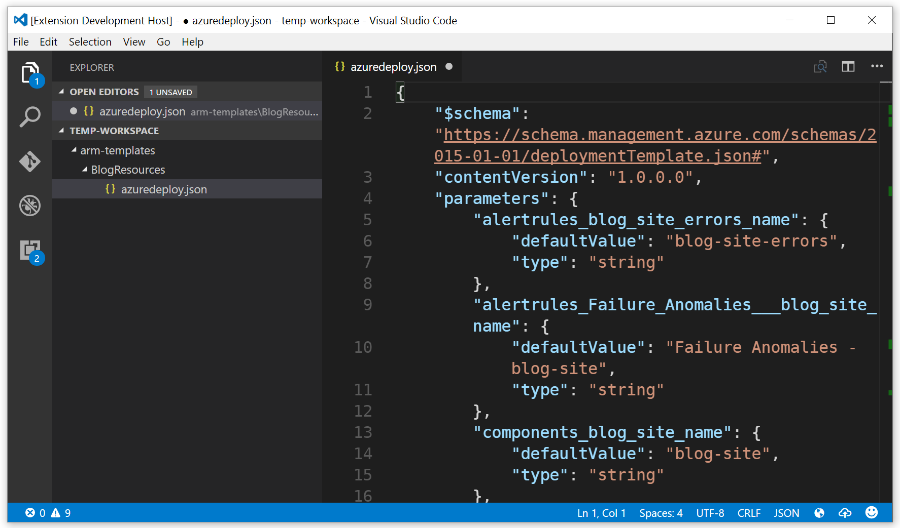

> **Note:** As of the 1.2.0 release time frame there are a few kinks in the particular Azure API call we're using; certain details of your resources might not be persisted exactly right. You can use the great features contained in the [Azure Resource Manager Tools extension](https://marketplace.visualstudio.com/items?itemName=msazurermtools.azurerm-vscode-tools) (which bundled with this extension) to make tweaks. The API owners are working on making great improvements to this functionality so it'll improve in future releases of the back-end API.

### Azure Batch account creation

From within Visual Studio Code you can use the `Create Azure Batch` command from the palette, shown below, to create new Azure Batch accounts. Future releases may add support for scripting against your Batch account, creating Jobs, and so forth. Feel free to send the team requests for additional Batch features via our [GitHub Issues page](https://github.com/bradygaster/azure-tools-vscode/issues).

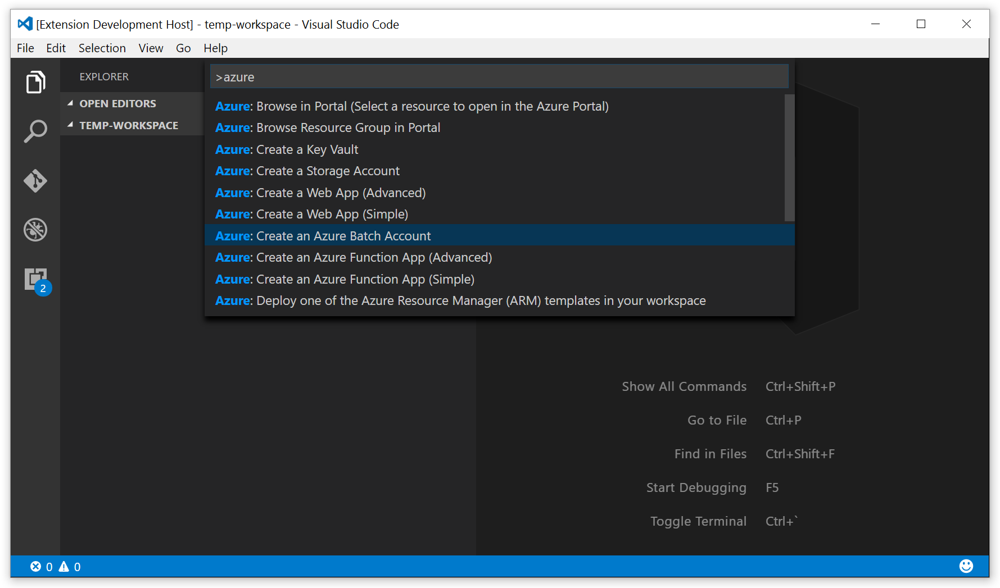

## Features
- Azure Key Vault Creation
- Search the [Azure QuickStart Templates](https://github.com/Azure/azure-quickstart-templates) GitHub repository
- Download Azure Resource Manager (ARM) template and parameter files to workspace
- Uses the [Azure Resource Manager Tools](https://marketplace.visualstudio.com/items?itemName=msazurermtools.azurerm-vscode-tools) extension to simplify the template-editing experience
- ARM template deployment to live Azure subscription
- Login with Microsoft Account (@hotmail.com, @live.com, etc.)
- Login with Azure Active Directory (or "Organizational") account
- Create App Service Web Apps
- Create App Service Function Apps
- Create Storage Accounts
- Get Storage Account connection string
- Browse to resource in portal
- Browse to resource group in portal
- Support for multiple Azure subscriptions
- Supports all Azure data centers

Each of these commands is visible directly from commands visible in the command palette. 

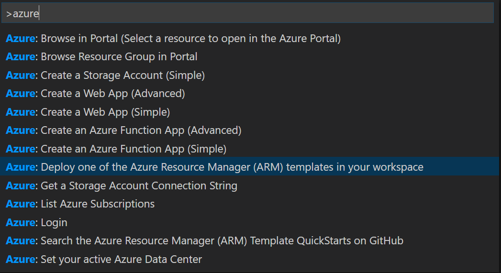

## Azure Key Vault creation

You can now use the Azure Tools for Visual Studio Code to create new Key Vault instances. Selecting the **Create Key Vault** command. Then you can create a new or select an existing resource group into which your new Key Vault will be created. 

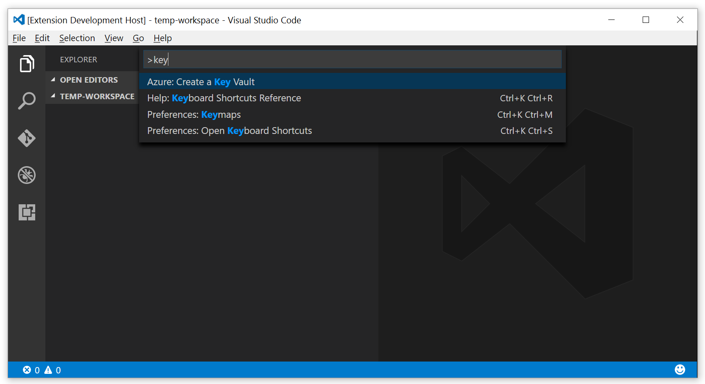

## Azure Resource Manager (ARM) Features
You can use keyword searches to find one of the numerous existing templates in the Azure QuickStart Templates repository, then download the templates you find and deploy them **all within Visual Studio Code**. 

### Search and Download from the Azure Template QuickStart Repository
Templates in the QuickStart repository are easily searchable from within Visual Studio Code. 

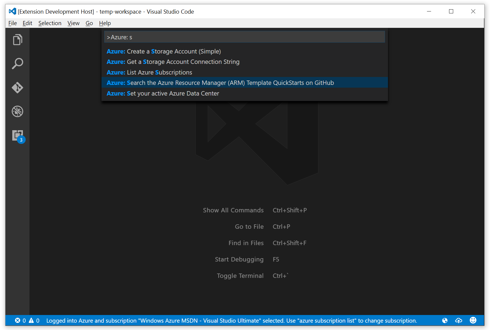

Type in a string or combination of strings for which you're searching:

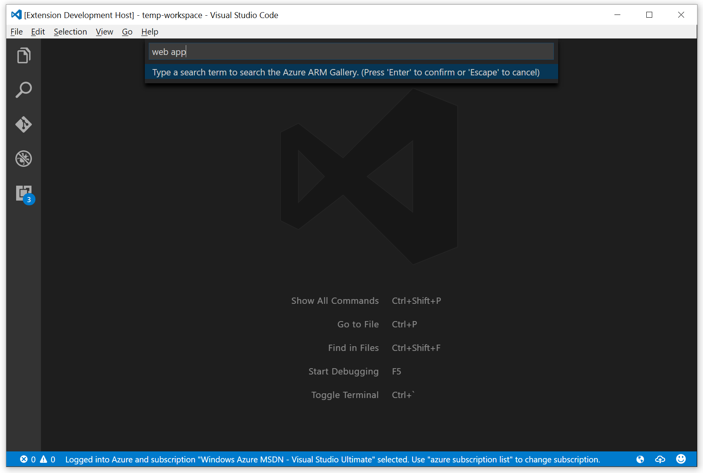

Select the appropriate template from the resulting list:

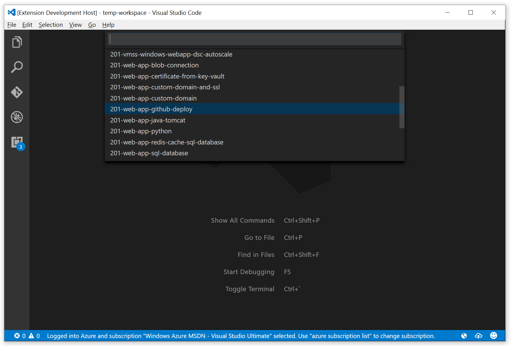

Note that the templates you select are downloaded into the `arm-templates` folder in your workspace. This way you can open the parameters file, make changes, and customize your deployment. 

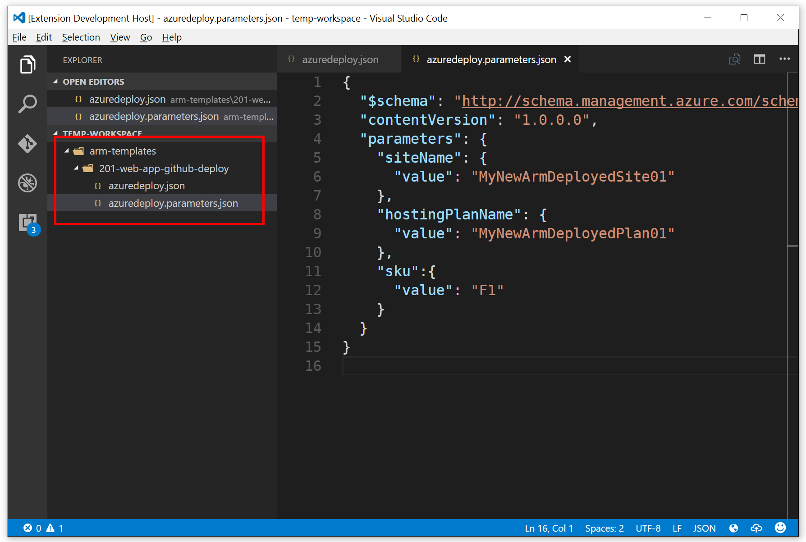

Now that the Azure Tools for Visual Studio Code takes a dependency on the Azure Resource Manager Tools for Visual Studio Code, editing of ARM templates you download from the repository is easier due to auto-completion, IntelliSense support, and the other ARM editing features provided in the Azure Resource Manager Tools extension. 

## Deploying Templates
Once you've edited your ARM template you can even use Visual Studio Code to deploy the template and add your Azure resources to your subscription. The *Deploy* command is visible in the command list below.

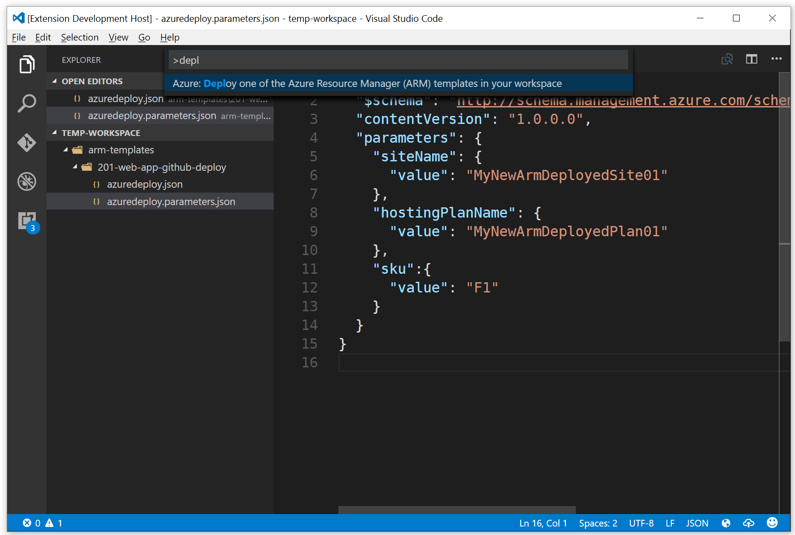

The various ARM templates you may have downloaded into your workspace will be shown in a list. This way, if you have multiple resources you wish to deploy in phases or you're just testing various templates out, you can deploy them individually. 

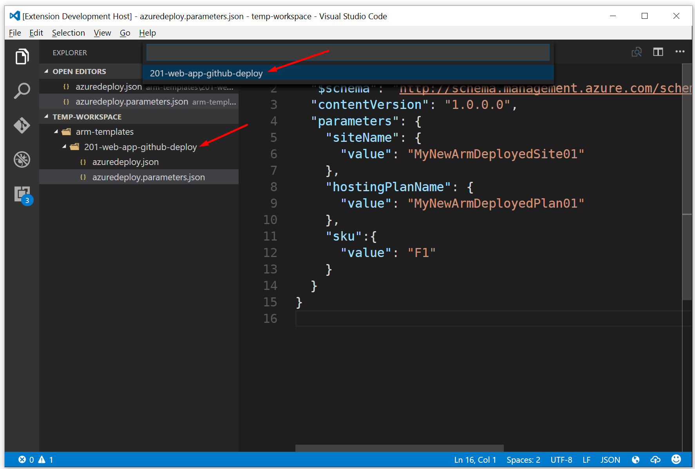

Deployments can be made to new or existing resource groups:

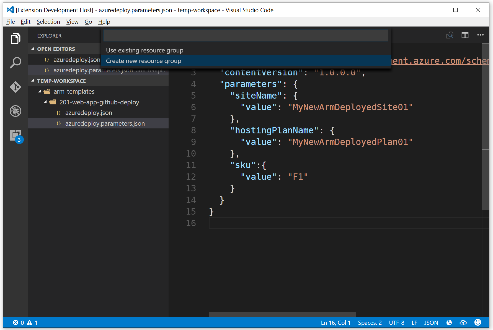

The status bar shows that the deployment being created: 

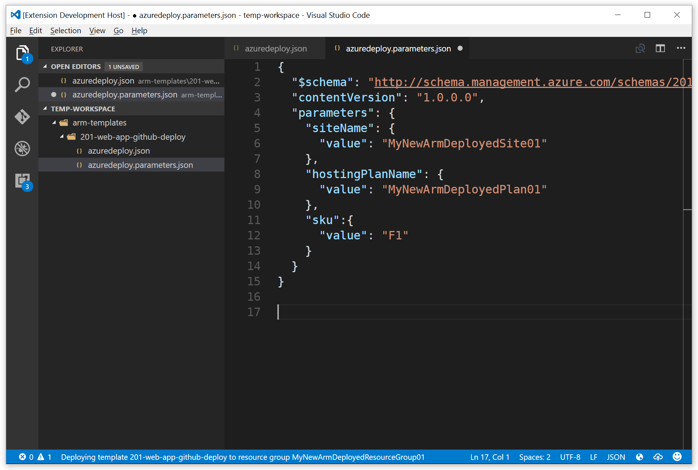

In this template scenario a GitHub-backed Web App is created. The portal screenshot below shows how the site is being deployed from GitHub once the template is deployed. 

Finally, Visual Studio Code provides an update when the deployment has completed. 

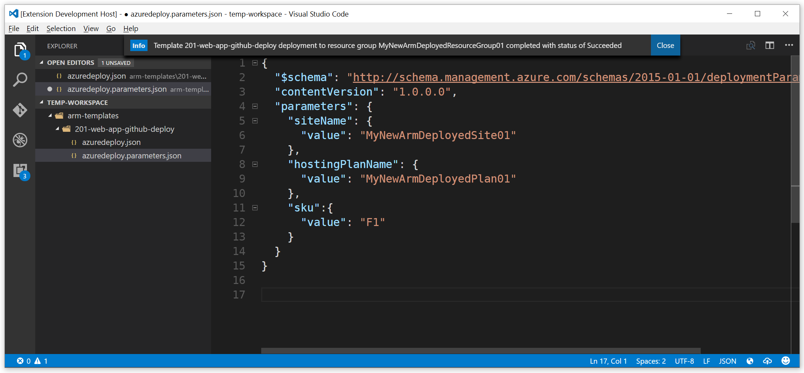

## Getting Started
Once you've installed the extension you can log in using either your organizational account or a Microsoft account such as a @live.com address. If you need to log in using an "organizationa account" there is no setup work to be done. Simply pull up the command palette and look for the **Azure: Login** command. This command runs the web-based interactive login process. 

### Logging in with a Microsoft Account?
If you're logging in using a Microsoft account (such as a @hotmail.com, @live.com, or @outlook.com account) you will need to set the `azure.tenantId` setting. The screenshot below shows this setting being entered using the *File -> Preferences -> User Settings* feature.

Once you've added the GUID-based setting (available Active Directory area in the [classic portal](https://manage.windowsazure.com) to the user or workspace settings using the `azure.tenantId` setting you can login using your Microsoft Account. The animated gif below demonstrates the full process of logging in using an MSA. 

## Creating Azure Resources
You can use the Azure Tools for Code to create App Service Web and Function Apps, and Azure Storage Accounts (and more resources are on the way). The video embedded below demonstrates using VS Code along with [Yeoman](http://yeoman.io) templates to create a new Azure Function App. 

In the case of Web and Function Apps the Azure Tools Extension allows for creation of your apps using a Simple flow, which creates a resource group, server farm, and app all at once. Or, you can use the Advanced flow to select an existing resource group or server farm in which to create your app. 

### Creating and Using Storage Accounts
You can also use the Azure Tools for Visual Studio Code to create an Azure Storage Account. In the video below you'll see how you can create a new Storage Account in a new or existing resource group. Then, using the *Get Storage Account Connection String* command, you can get the connection string for an existing storage account copied to your clipboard. Then, you can easily paste it into a configuration file so your app can store and retrieve data using Azure Storage. 

## Browsing Resources in the Azure Portal
Two commands are provided to enable easy access to your Azure resources in the portal. By opening the command palette and typing **Browse** you will see the convenient "Browse in Portal" options. 

You can navigate directly to an individual resource's portal page:

Or to a resource group's portal page:

## Extension Settings

`azure.tenantId` : The GUID specifier for the tenant you intend on authenticating against. This is *required* if you're attempting to log in using a Microsoft Account like @outlook.com, @hotmail.com, or @live.com. 

## Requirements

All dependencies are listed in [package.json](package.json). You will need an Azure subscription. If you don't yet have an Azure subscription [sign up for a free account](https://azure.microsoft.com/en-us/free/) and then you can make use of the features in this extension, not to mention all the great features Azure offers. 

## Known Issues

All feature ideas and issues should be reported using [GitHub issues](https://github.com/bradygaster/azure-tools-vscode/issues).

## Release Notes

You can find notes for each release in the [changelog](changelog.md).