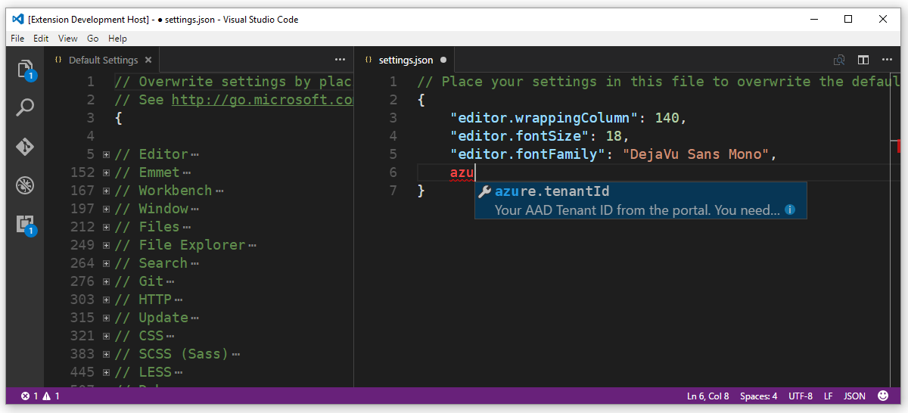
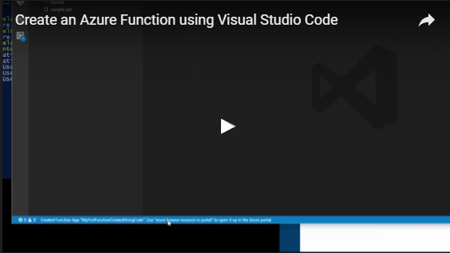

# Azure Tools for Visual Studio Code

This extension for [Visual Studio Code](http://code.visualstudio.com) gives Azure developers some convenient commands for creating or accessing resources directly in the editor. 

## Features

- Login with Microsoft Account (@hotmail.com, @live.com, etc.)
- Login with Azure Active Directory (or "Organizational") account
- Create App Service Web Apps
- Create App Service Function Apps
- Create Storage Accounts **New!**
- Get Storage Account connection string **New!**
- Browse to resource in portal
- Browse to resource group in portal **New!** 
- Support for multiple Azure subscriptions
- Supports all Azure data centers

Each of these commands is visible directly from commands visible in the command palette. 

## Getting Started
Once you've installed the extension you can log in using either your organizational account or a Microsoft account such as a @live.com address. If you need to log in using an "organizationa account" there is no setup work to be done. Simply pull up the command palette and look for the **Azure: Login** command. This command runs the web-based interactive login process. 

### Logging in with a Microsoft Account?
If you're logging in using a Microsoft account (such as a @hotmail.com, @live.com, or @outlook.com account) you will need to set the `azure.tenantId` setting. The screenshot below shows this setting being entered using the *File -> Preferences -> User Settings* feature.

Once you've added the GUID-based setting (available Active Directory area in the [classic portal](https://manage.windowsazure.com) to the user or workspace settings using the `azure.tenantId` setting you can login using your Microsoft Account. The animated gif below demonstrates the full process of logging in using an MSA. 

## Creating Azure Resources
You can use the Azure Tools for Code to create App Service Web and Function Apps, and Azure Storage Accounts (and more resources are on the way). The video embedded below demonstrates using VS Code along with [Yeoman](http://yeoman.io) templates to create a new Azure Function App. 

In the case of Web and Function Apps the Azure Tools Extension allows for creation of your apps using a Simple flow, which creates a resource group, server farm, and app all at once. Or, you can use the Advanced flow to select an existing resource group or server farm in which to create your app. 

### Creating and Using Storage Accounts
**New!** You can also use the Azure Tools for Visual Studio Code to create an Azure Storage Account. In the video below you'll see how you can create a new Storage Account in a new or existing resource group. Then, using the *Get Storage Account Connection String* command, you can get the connection string for an existing storage account copied to your clipboard. Then, you can easily paste it into a configuration file so your app can store and retrieve data using Azure Storage. 

## Browsing Resources in the Azure Portal
Two commands are provided to enable easy access to your Azure resources in the portal. By opening the command palette and typing **Browse** you will see the convenient "Browse in Portal" options. 

You can navigate directly to an individual resource's portal page:

Or to a resource group's portal page:

## Extension Settings

`azure.tenantId` : The GUID specifier for the tenant you intend on authenticating against. This is *required* if you're attempting to log in using a Microsoft Account like @outlook.com, @hotmail.com, or @live.com. 

## Requirements

All dependencies are listed in [package.json](package.json). You will need an Azure subscription. If you don't yet have an Azure subscription [sign up for a free account](https://azure.microsoft.com/en-us/free/) and then you can make use of the features in this extension, not to mention all the great features Azure offers. 

## Known Issues

All feature ideas and issues should be reported using [GitHub issues](https://github.com/bradygaster/azure-tools-vscode/issues).

## Release Notes

You can find notes for each release in the [changelog](changelog.md).